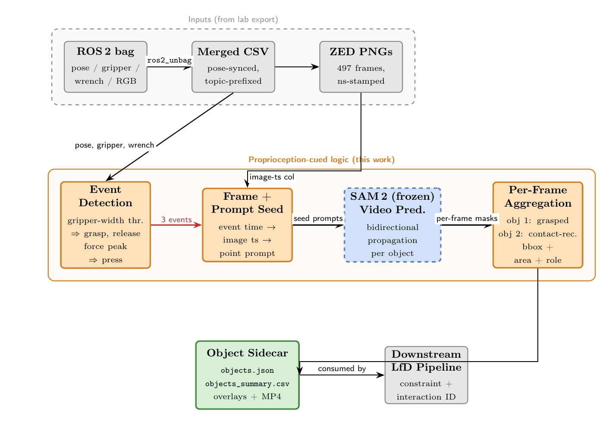

# RLBD — Robot Learning from Demonstration

Vision module for the lab's ROS 2 LfD pipeline. Given a demonstration bag
(robot pose, gripper, force/torque, ZED RGB), it identifies the task-relevant
objects per interaction phase and writes a JSON sidecar consumable by
downstream LfD code.

## Pipeline



Proprioceptive event detection on the merged CSV identifies the grasp, press,
and release moments. Each event indexes the corresponding ZED frame, which
seeds SAM 2 (frozen) with a point prompt. Bidirectional video propagation
yields per-frame, role-tagged masks aggregated into a JSON sidecar.

## Layout

```
Code/        Python scripts (pipeline + figure generators)
Docs/        Writeup PDF/source, setup notes, failure-mode log
Data/        Trial data (gitignored except small legacy CSV)
figures/     Generated figures used by the writeup
```

Model checkpoints (`*.pth`, `*.pt`) and Python venvs (`.venv_*/`) live at
the repo root, are gitignored, and must be created locally.

## Setup

Three Python environments are used (versions and reasons documented in
`CLAUDE.md`):

- `.venv_analysis` — Python 3.9, pandas/numpy/matplotlib
- `.venv_sam2` — Python 3.11, SAM 2 + torch with MPS
- `.venv_dado` — Python 3.11, transformers (DINOv2 + Depth-Anything)

Checkpoints:

- SAM 1 ViT-H: `sam_vit_h_4b8939.pth`
  (`https://dl.fbaipublicfiles.com/segment_anything/sam_vit_h_4b8939.pth`)
- SAM 2.1 Hiera-L: `sam2.1_hiera_large.pt`
  (`Code/download_sam2_ckpt.py` fetches it)

## End-to-end run on a bag

Run from the repo root. `<trial>` is a bag folder exported by the lab's
`ros2_unbag` pipeline.

```bash
.venv_analysis/bin/python Code/analyze_demo.py --trial <trial>
.venv_sam2/bin/python Code/prepare_sam2_frames.py \
    --src <trial>/zed_zed_node_rgb_color_rect_image_compressed \
    --dst frames_jpg
.venv_sam2/bin/python Code/propagate_demo.py \
    --trial <trial> --ckpt sam2.1_hiera_large.pt --jpg_dir frames_jpg
.venv_sam2/bin/python Code/propagate_cup.py \
    --trial <trial> --ckpt sam2.1_hiera_large.pt --jpg_dir frames_jpg
.venv_analysis/bin/python Code/build_sidecar.py
```

Output bundle in `figures/identify/`: `objects.json`, `objects_summary.csv`,
per-frame overlays, and a stitched MP4.

## Writeup

```bash
pdflatex -output-directory=Docs Docs/writeup.tex
```

(Run twice to resolve references.)

## More

- `CLAUDE.md` — full pipeline notes, hard-coded knobs, conventions.
- `Docs/FAILURE_MODES.md` — what does not work yet on the current trial.
- `Docs/setup_info.md` — legacy ROS 2 / bag-export setup notes.
