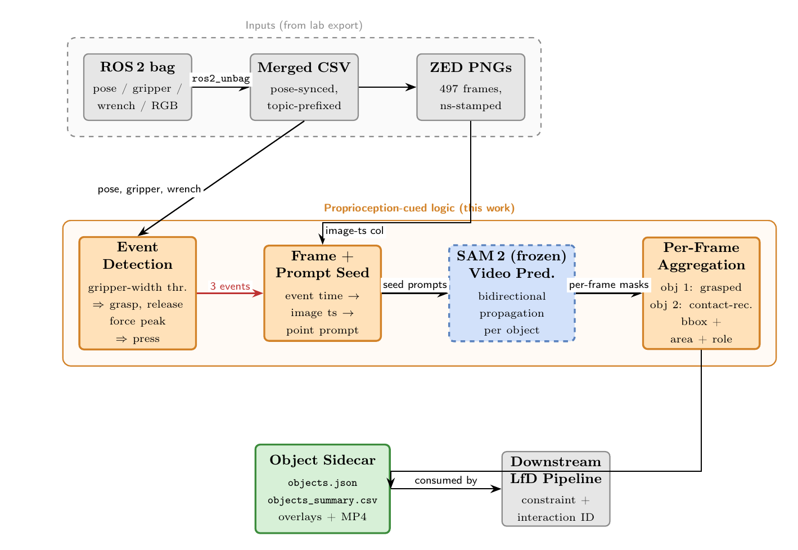

# RLBD — Robot Learning from Demonstration

Vision module for the lab's ROS 2 LfD pipeline. Given a demonstration bag
(robot pose, gripper, force/torque, ZED RGB-D), it identifies task-relevant
objects per interaction phase and writes a JSON sidecar consumable by
downstream LfD code.

## Authoritative project status

**The sole focus is vision-based recognition of objects relevant to robot
tasks, extracted from task demonstration data.** See
[`LAB_DELIVERABLE_A.md`](LAB_DELIVERABLE_A.md) for scope, current status,
acceptance criteria, and execution order. That file overrides historical
experiment notes elsewhere in the repository.

**Archived, not part of this scope** (kept for reference, not deleted):
camera-to-force-sensor calibration / wrench-projected geometric contact
grounding (`archive/wrench_force_calibration/`) and the manuscript/paper
workstream, formerly "B" (`archive/manuscript_b_paper/`). Neither is required
for the deliverable and the active pipeline has zero dependency on either.

A is currently an operational semi-automatic pipeline, not a finished
automatic deliverable. Event detection, SAM 2 tracking, and sidecar generation
work on existing recordings. The remaining gates are reliable automatic object
selection on held-out recordings and a demonstrated downstream ROS 2
integration test.

Current frozen evaluation (2026-09-03): grasped accepts 0/5 cases across four
independent groups; contact accepts 2/7 correctly (precision 1.00, coverage
0.286) across three groups. A 6,561-rule baseline could not make the existing
features meet the gate; a 19,683-rule extension with force-anchored local-flow
contrast improved in-sample coverage but collapsed held-out precision to 0.40.
Therefore that cue is rejected. A subsequent grasp attachment-transition gate
also failed: the correct object was reachable at the frozen 20% anchor in only
3/5 cases, and even an all-data fit accepted 0/5. No feasibility cue was
promoted to production. See `LAB_DELIVERABLE_A.md` for the resulting stop
condition.

**Proposal-pool coverage is role-specific — do not generalise the 7/7 figure.**
The contact pool contains the correct object in 7/7 cases
(`figures/contact_ceiling_study.json`). For the **grasped** role it had never
been measured until 2026-10-05, and it is **27/41 frames** on the frozen pool —
so 14 frames were unwinnable by any ranker, and selection was being blamed for
a generation failure. Denser automask settings raised it to **30/41**
(`t002_cube` 2/12 → 6/12).

### External-model and VLM tests (2026-09-30, 2026-10-05) — all stop-gated

| Test | Result |
|---|---|
| HOI-DETR (grasped + contact) | 0/5 and 0/7 accepted. Zero detections ≥ 0.3 on any of our frames; trained on human hands. |
| DistinctNet (raw and stabilised) | 0/5 accepted; foreground IoU 0.22–0.39, below the 0.50 floor. Assumes a world-fixed camera. |
| Molmo 2 → cached-proposal lookup | 0/5 under the pre-registered criterion. |
| Molmo 2 → SAM 2 point prompt | 1/5 under the pre-registered rule (SAM 2's own top-confidence mask). |

None authorised production integration. What the VLM round did establish, and
these two numbers involve no fitting of ours:

- **Molmo 2 locates the held object in 4/5 cases**, including both nut
  recordings where every hand-written rule scored zero.
- **SAM 2 prompted with that point generates a correct mask in 4/5**, including
  two frames whose cached-pool ceiling (0.245, 0.314) made them impossible.

The remaining failure is choosing among SAM 2's three nested masks. Taking the
whole-object mask would score 3/5 — but that was identified *after* seeing the
scores, so it is a hypothesis, not a result, and 3/5 is still below the 4/5
gate. Settling it honestly needs recordings nobody has looked at. That request
went to the lab on 2026-10-05.

## Pipeline



Proprioceptive event detection on the merged CSV identifies grasp, release,
and force-contact moments (gracefully degrading when either the gripper or
the F/T sensor is absent from a given bag). Each event indexes the
corresponding ZED frame, which seeds SAM 2 (frozen) with a point or box
prompt. Bidirectional video propagation yields per-frame, role-tagged masks
for an arbitrary number of tracked objects, aggregated into a JSON sidecar.

## Rig

Franka Research 3 arm, Franka Hand gripper, Bota SensONE wrist F/T sensor,
ZED Mini RGB-D camera. The camera is **eye-in-hand**: mounted on a bracket
bolted to the gripper, not fixed in the world. `current_pose` reports the
Bota SensONE's own F/T measurement frame directly (confirmed by the lab,
2026-09-10). The fixed transform from that frame to the camera
(`bota_to_camera`) is not trusted and camera-to-force-sensor calibration is
archived (`archive/wrench_force_calibration/`) — not required for this
deliverable's scope. See `calibration.yaml` for the machine-readable trust
state.

## Layout

```
Code/        Active pipeline + diagnostics (38 scripts)
Docs/        Writeup PDF/source, setup notes, GPU-host runbooks
Data/        Trial data (gitignored except small legacy CSV)
config/      deliverable_rig.yaml, evaluation_manifest.yaml (per-cycle ground truth)
schemas/     objects.schema.json — the versioned sidecar contract
tests/       Calibration-independent regression suite (39 tests)
scripts/     One-shot host-side orchestration (GPU bakeoff runner)
docker/      Dockerfiles for isolated external-model containers
figures/     Generated figures and study outputs
archive/     Nothing here is deleted; see archive/README.md
  wrench_force_calibration/  camera-to-F/T calibration (out of scope)
  manuscript_b_paper/        the paper workstream (not pursued)
  negative_results/          measured failures, kept as evidence
  superseded_selectors/      replaced by Code/select_objects.py
  superseded_sidecar/        replaced by Code/build_sidecar_multi.py
  legacy_extraction/         replaced by the lab's ros2_unbag
  backup_results_20260830/   historical output snapshot
```

Model checkpoints (`*.pth`, `*.pt`) and Python venvs (`.venv_*/`) live at
the repo root, are gitignored, and must be created locally.

## Setup

Three Python environments are used (versions and reasons documented in
`CLAUDE.md`):

- `.venv_analysis` — Python 3.9, pandas/numpy/matplotlib, plus `mcap`/
  `mcap-ros2-support` for the `.mcap` fallback extractor
- `.venv_sam2` — Python 3.11, SAM 2 + torch with MPS
- `.venv_dado` — Python 3.11, transformers (DINOv2 + Depth-Anything)

`.venv_dado` is only needed for the archived DADO baseline
(`archive/negative_results/`) and is not required for a normal run. A separate
conda environment (`occ`, pythonocc-core) was used for CAD/STEP inspection
during the archived calibration work (`archive/wrench_force_calibration/`) and
is likewise not part of the per-bag pipeline.

Checkpoints:

- SAM 1 ViT-H: `sam_vit_h_4b8939.pth`
  (`https://dl.fbaipublicfiles.com/segment_anything/sam_vit_h_4b8939.pth`)
- SAM 2.1 Hiera-L: `sam2.1_hiera_large.pt`
  (`Code/download_sam2_ckpt.py` fetches it)

## End-to-end run on a bag

The canonical Deliverable A entry point is:

```bash
.venv_analysis/bin/python Code/run_deliverable.py \
    --trial <trial> --out <output_dir> --offload-video-to-cpu
```

It validates the export, detects all interaction cycles, selects role-tagged
SAM box prompts, propagates each accepted object, builds the sidecar, and runs
the output quality gate. Exit code `0` means accepted, `2` means automatic
selection safely abstained and wrote review diagnostics, and `1` means an
input or execution failure. A review-required run never publishes
`objects.json`.
Grasped-object selection probes multiple frames in the closed hold and requires
per-frame confidence plus spatial consistency; temporal agreement alone cannot
override a low-confidence winner.

Use `--select-only` to stop after automatic selection. An operational manual
recovery can be supplied as
`--override role:cycle:x0,y0,x1,y1`; the resulting provenance is manual and is
excluded from automatic evaluation.

The lower-level commands below remain useful for diagnosis. Run from the repo
root. `<trial>` is a bag folder exported by the lab's `ros2_unbag` pipeline
(e.g. `Data/lfdws_t001/lfdws_t001`).

```bash
# 1. detect grasp / release / force-contact events on the merged CSV
.venv_analysis/bin/python Code/analyze_demo.py --trial <trial> --out <fig_dir>

# 2. convert PNGs to the zero-padded JPGs SAM 2 expects
.venv_sam2/bin/python Code/prepare_sam2_frames.py \
    --src <trial>/zed_zed_node_rgb_color_rect_image_compressed \
    --dst frames_jpg

# 3. calibration-free role-aware proposal selection
.venv_sam2/bin/python Code/select_objects.py \
    --trial <trial> --out <fig_dir>/selection --ckpt sam_vit_h_4b8939.pth

# 4. propagate each tracked object across the demo, bidirectionally
# (add --offload_video_to_cpu if the trial has enough frames to exceed
#  device memory during init_state -- see CLAUDE.md)
.venv_sam2/bin/python Code/propagate_demo_bidir.py \
    --trial <trial> --ckpt sam2.1_hiera_large.pt --jpg_dir frames_jpg \
    --out <fig_dir>/propagation_grasped
# for additional objects beyond the first two roles, seed manually:
.venv_sam2/bin/python Code/propagate_object_n.py \
    --trial <trial> --ckpt sam2.1_hiera_large.pt --jpg_dir frames_jpg \
    --obj_id 3 --role <role_name> --seed_img_id <id> --seed_box "x0,y0,x1,y1" \
    --out <fig_dir>/propagation_obj3

# 5. compose the sidecar bundle from however many objects were propagated
.venv_analysis/bin/python Code/build_sidecar_multi.py \
    --trial <trial> \
    --object "1:grasped:<fig_dir>/propagation_grasped_summary.csv:0,255,0" \
    --object "2:contact_receiver:<fig_dir>/propagation_cup_summary.csv:255,0,255" \
    --out <fig_dir>/identify
```

`Code/build_sidecar_multi.py` is the canonical sidecar builder — it accepts
any number of `--object obj_id:role:summary_csv:bgr_color` entries, so a
single-object trial (no contact event) and a four-object trial both go
through the same tool. The fixed two-role version is archived at
`archive/superseded_sidecar/build_sidecar.py`.

Output bundle: `objects.json`, `objects_summary.csv`, per-frame overlays,
and a stitched MP4. Use a distinct `--out` per trial so results don't
overwrite each other — every script that writes a shared output path also
backs up any pre-existing file to `<path>.bak` first, as a second layer of
protection.

Optional follow-ups:

```bash
.venv_analysis/bin/python Code/mask_area_plot.py --trial <trial>  # mask-area-over-time figure
.venv_analysis/bin/python Code/force_overlay.py --trial <trial>   # uncalibrated force-arrow sanity check
.venv_analysis/bin/python Code/presence_signal.py                 # bbox-diagonal presence diagnostic
.venv_analysis/bin/python Code/trial_report.py --trial <trial> --sidecar_json <fig_dir>/identify/objects.json --fig_dir <fig_dir>   # one diagnostic PDF
```

Object-identity clustering (`object_identity*.py`) is archived under
`archive/negative_results/` — it fragments and cross-contaminates across
trials, and SAM 2's per-trial `obj_id` already supplies the within-trial
identity the deliverable needs.

Camera-to-force-sensor calibration (`project_ee.py`, `calibrate_hand_eye.py`,
`wrench_ray_validate.py`) is archived — `archive/wrench_force_calibration/` —
not required for this deliverable's scope; see that directory's `README.md`
and `CALIBRATION_LOG.md`. `bota_to_camera.filled` stays `false`.
`current_pose`'s frame is resolved though (it's the Bota SensONE's own F/T
measurement frame — confirmed by the lab, 2026-09-10) and that fact stays
live in `calibration.yaml`. The Franka Research 3 arm URDF is vendored at
`Data/fr3.urdf`.

`auto_seed.py` (archived, `archive/superseded_selectors/`) and the propagation
scripts' hard-coded fallbacks are legacy experimental paths and are never used
by `run_deliverable.py`. Low selector confidence must produce exit code 2 and a
review report; it must not fall back to a recording-specific seed.

The versioned sidecar contract is
[`schemas/objects.schema.json`](schemas/objects.schema.json). Validate or read
an output independently with `Code/validate_sidecar.py` and
`Code/sidecar_consumer.py`.

Run the calibration-independent regression suite with:

```bash
.venv_analysis/bin/python -m unittest discover -s tests -v
```

Automatic-selection evidence is reported separately from manual recovery.
After generating selection reports for the recordings listed in
`config/evaluation_manifest.yaml`, evaluate the frozen selector with repeated
`--report recording_id:path/to/selection_report.json` arguments:

```bash
.venv_analysis/bin/python Code/evaluate_selection.py \
    --report lfdws_t001:<output>/selection_report.json \
    --report lfdws_t002_new:<output>/selection_report.json
```

The acceptance bar is at least 90% precision and 75% automatic coverage for
both the grasped and contact categories, across at least three independent
recording groups. Until that command passes on the required held-out evidence,
the selector is implemented but not validated as the completed deliverable.

If a bag arrives as a raw `.mcap` instead of a `ros2_unbag` export (e.g. the
lab's exporter doesn't yet handle a depth topic, or the bag hasn't been run
through the export pipeline at all), `Code/mcap_extract.py` produces the
same merged-CSV + PNG layout directly from the bag — no ROS 2 install
needed:

```bash
.venv_analysis/bin/python Code/mcap_extract.py \
    --bag <trial>_0.mcap --trial_name <trial> --out Data
```

## Writeup

```bash
pdflatex -output-directory=Docs Docs/writeup.tex
```

(Run twice to resolve references.) `Docs/writeup.tex` is a running progress
document — pages accumulate as dated update sections; earlier sections are
never edited, only appended to.

## More

- `CLAUDE.md` — full pipeline notes, hard-coded knobs, conventions.
- `Docs/setup_info.md` — legacy ROS 2 / bag-export setup notes.
- `archive/README.md` — index of everything archived and why.
- `Docs/UBUNTU.md` — RTX 4080 host preflight and bakeoff procedure.
- `plan_5oct.md` — VLM bakeoff handoff for a GPU-host session.
